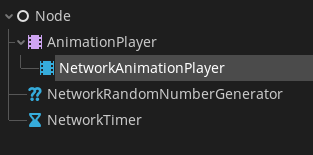

> [!Note]
> This addon is for Godot 4.4.
>
> Please check out the Godot 3.x branch for the 3.x version.

# Godot Rollback Netcode Mono 🔃


This is an addon that provides C# support for [SnopekGames' Godot Rollback Netcode addon](https://gitlab.com/snopek-games/godot-rollback-netcode).

Please check out their repo for general instructions on how to install and use their rollback plugin. The tutorial videos linked in their readme are especially good at getting you up to speed on how the plugin works.

Once you're familiar with the plugin, check out the [Mono (C#) Support](#mono-c-support) section to learn more about the C# support.


## Installation

1. Make sure the `godot-rollback-netcode` addon is installed. [See the original README for how to do that](ORIGINAL_README.md).
1. Copy the `addons/GodotRollbackNetcodeMono` directory from this project into
   your Godot project _at the exact same path_.

## Mono (C#) Support

This addon features C# support primarily via wrapper classes that
wrap around the existing GDScript code.

To enable mono support, add the `res://addons/GodotRollbackNetcodeMono/SyncMonoInit.cs` script as an
autoload singleton in **Project** -> **Project settings...** and the "Autoload" tab.

### Wrapper Classes

To fetch GDScript nodes, you can use the `GetNodeAsWrapper` extension method provided by `GodotRollbackNetcode.Utils`. This will fetch the node at the given path and then wrap it in a C# wrapper class which you can then use like a normal C# class.

```CSharp
// Tree Layout
//
// Root <- this C# script
//  '- Timer <- NetworkTimer.gd
//  '- SomeNode
//     '- Rng <- NetworkRandomNumberGenerator.gd
//     '- AnimationPlayer <- NetworkAnimationPlayer.gd

public override _Ready()
{
	NetworkTimerWrapper timer = this.GetNodeAsWrapper<NetworkTimerWrapper>("Timer");
	NetworkRandomNumberGeneratorWrapper rng = this.GetNodeAsWrapper<NetworkRandomNumberGeneratorWrapper>("SomeNode/Rng");
	NetworkAnimationPlayerWrapper animationPlayer = this.GetNodeAsWrapper<NetworkAnimationPlayerWrapper>("AnimationPlayer");
}
```

Signals are forwarded to C# events, but you may also use the `Connect` method directly on the wrapper to connect to a signal on the GDScript node. Wrapper classes automatically forwards it's own `Connect` method to the GDScript node.

```CSharp
public override _Ready()
{
	NetworkTimerWrapper timer = this.GetNodeAsWrapper<NetworkTimerWrapper>("Timer");

	// Connect C# events
	timer.Timeout += OnTimeout;

	// Connect Signals
	timer.Connect("timeout", this, nameof(OnTimeout));
}

public override void _Notification(int what)
{
	if (what == NotificationPredelete)
	{
		timer.Timeout -= OnTimeout; // Don't forget to unsubscribe C# events
	}
}

public void OnTimeout()
{
	GD.Print("Timed out!")
}
```

### Base Classes

The addon features base classes that you can extend. These are `BaseNetworkAdaptor`, `BaseHashSerializer`, and `BaseMessageSerializer`. Once you extend a class, you can link them up like you normally would with GDScript NetworkAdaptors, HashSerializers, and MessageSerializers etc.

For example you could make a `CustomMessageSerializer` like so

```CSharp
// Stored in res://SomePath/To/CustomMessageSerializer.cs
using GodotRollbackNetcode;

public class CustomMessageSerializer : BaseMessageSerializer
{
	private Dictionary<string, byte> inputPathMapping;
	private Dictionary<byte, string> inputPathMappingReverse;

	[Flags]
	public enum HeaderFlags
	{
		NONE = 0,
		HAS_INPUT_VECTOR = 1
	}

	public CSharpMessageSerializer()
	{
		inputPathMapping = new Dictionary<string, byte>();
		inputPathMapping["/root/Main/ServerPlayer"] = 1;
		inputPathMapping["/root/Main/ClientPlayer"] = 2;

		inputPathMappingReverse = inputPathMapping.ToDictionary((i) => i.Value, (i) => i.Key);
	}

	public override byte[] SerializeInput(GDDictionary allInput)
	{
		var buffer = new StreamPeerBuffer();
		buffer.Resize(16);

		buffer.Put32((int)allInput["$"]);
		buffer.PutU8(Convert.ToByte(allInput.Count - 1));

		var sortedKeys = allInput.Keys.OfType<string>().OrderBy((key) => key);
		foreach (string path in sortedKeys)
		{
			if (path == "$")
				continue;
			buffer.PutU8(inputPathMapping[path]);

			HeaderFlags header = HeaderFlags.NONE;

			GDDictionary input = (GDDictionary)allInput[path];
			if (input.Contains("input_vector"))
				header |= HeaderFlags.HAS_INPUT_VECTOR;

			buffer.PutU8((byte)header);

			if (input.Contains("input_vector"))
			{
				Vector2 inputVector = (Vector2)input["input_vector"];
				buffer.PutFloat(inputVector.x);
				buffer.PutFloat(inputVector.y);
			}
		}
		buffer.Resize(buffer.GetPosition());
		return buffer.DataArray;
	}

	public override GDDictionary UnserializeInput(byte[] serialized)
	{
		var buffer = new StreamPeerBuffer();
		buffer.PutData(serialized);
		buffer.Seek(0);

		GDDictionary allInput = new GDDictionary();

		allInput["$"] = buffer.GetU32();

		var inputCount = buffer.GetU8();
		if (inputCount == 0)
			return allInput;

		for (int i = 0; i < inputCount; i++)
		{
			string path = inputPathMappingReverse[buffer.GetU8()];
			GDDictionary input = new GDDictionary();
			HeaderFlags header = (HeaderFlags)buffer.GetU8();

			if (header.HasFlag(HeaderFlags.HAS_INPUT_VECTOR))
				input["input_vector"] = new Vector2(buffer.GetFloat(), buffer.GetFloat());

			allInput[path] = input;
		}

		return allInput;
	}
}
```

and then go to **Projects** -> **Project Settings** -> **Network** -> **Rollback**, and replace `MessageSerializer` with the path to the C# class (ie. `res://SomePath/To/CustomMessageSerializer.cs`).

#### Custom MessageSerializer

For custom message serializers, certain values like the state hash (stored as the "$" key in the input dictionary of SerializeMessageInput) are 32-bit values stored in 64-bit ints in GDScript. However in C#, all GDScript ints are converted to C# ints, which are 32-bit. This means there will be overflow when these values are passed into your MessageSerializer code. and you may get a negative number, even though they were positive 32-bit integers on the GDScript side.

If you are using StreamPeerBuffer to serialize and deserialize your input, you would have to serialize these overflowed values by first serializing them as 32-bit ints, then unserializing them as unsigned 32-bit ints.

```CSharp
public override byte[] SerializeInput(GDDictionary allInput)
{
	var buffer = new StreamPeerBuffer();

	buffer.Put32((int)allInput["$"]); // <- Put as signed 32-bit integer

	...
}

public override GDDictionary UnserializeInput(byte[] serialized)
{
	var buffer = new StreamPeerBuffer();
	buffer.PutData(serialized);
	buffer.Seek(0);

	GDDictionary allInput = new GDDictionary();

	allInput["$"] = buffer.GetU32(); // <- Retreive as unsigned 32-bit integer

	...
}
```

### C# Network Nodes



This addons also comes with C# network nodes for RNG, timing, and animation playing.

## Logo credits

The logo is composed of these images:

- https://pxhere.com/en/photo/1451861 (License: CC0)
- https://godotengine.org/press (License: CC-BY-4.0 by Andrea Calabró)

## License

Copyright 2021-2022 David Snopek.

Licensed under the [MIT License](LICENSE.txt).
